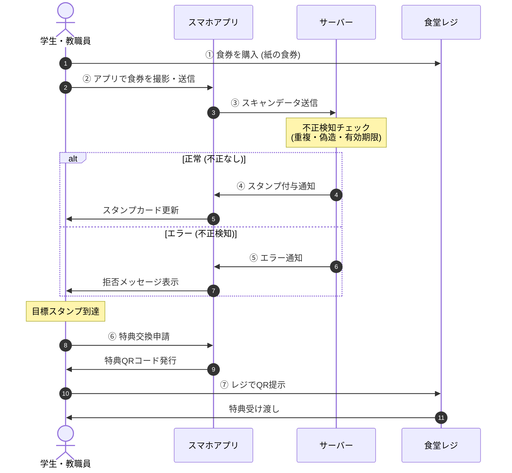
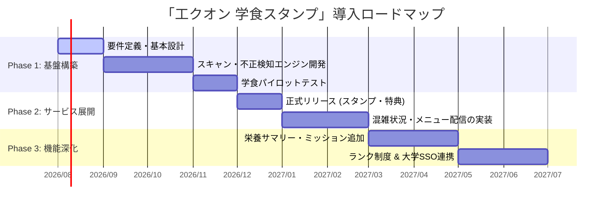

# 「工クオン 学食スタンプ」導入・運営企画提案書（草案）

学生食堂の利用促進と利便性向上、および食堂運営のデジタル化を推進するためのスマートフォン向けWebアプリケーション（PWA）「工クオン 学食スタンプ」の企画提案書およびカスタマー向け機能説明の草案です。

---

## 1. 企画背景と目的

学生食堂（以下、学食）は学生や教職員にとって日常的な憩いの場であり、欠かせないインフラです。しかし、キャッシュレス決済の普及や学外の競合店舗の増加に伴い、より魅力的で利用しやすい環境づくりが求められています。

本プロジェクトは、コカ・コーラ社の「Coke ON」アプリのリワードシステムにインスパイアされ、学食の利用頻度に応じたインセンティブを提供することで、以下の目的を達成します。

* **学食の利用促進**: リピート率の向上と、客単価500円以上利用時のボーナススタンプなど。
* **食堂運営の最適化**: 混雑状況の可視化による利用時間の分散と、データに基づくメニュー改善。
* **完全なデジタル化**: 既存の食券券売機システムに一切手を加えることなく、スマートフォンのカメラ（OCR・画像認識）だけでスタンプシステムを即時導入。

---

## 2. 全体システムフロー

利用者が学食で食券を購入してから、スタンプを獲得し、特典を利用するまでのフローは以下の通りです。

### 【A4印刷用】システムフロー手順一覧

| No. | ステップ | 送信元 → 送信先 | 処理内容・詳細 |
| :---: | :--- | :--- | :--- |
| **1** | 食券購入 | 利用者 → 食堂レジ | 既存の券売機で通常通り紙の食券を購入。 |
| **2** | スキャン申請 | 利用者 → スマホアプリ | アプリの食券スキャナーで食券を撮影・情報入力。 |
| **3** | データ送信 | アプリ → サーバー | 画像および読み取った通し番号・金額・日時を送信。 |
| **4** | 不正検知照合 | サーバー（内部判定） | 重複スキャン、偽造、時間制限、一意なIDハッシュを照合。 |
| **5** | スタンプ判定 | サーバー → アプリ | **【正常】** スタンプ付与（500円以上はWスタンプ） **【不正】** 付与拒否・エラー通知を表示。 |
| **6** | 特典交換 | 利用者 → スマホアプリ | 目標スタンプ達成時、希望の特典を選んでQRコードを発行。 |
| **7** | 特典利用 | 利用者 → 食堂レジ | 食堂レジでQRコードを提示し、ドリンクや割引を受け取る。 |

---

## 3. アプリの使い方と機能説明（カスタマー向け）

利用者が毎日楽しく、直感的に学食を利用できるようにするための画面構成と操作フローです。具体的な画面レイアウトについては、文書後半の**図1〜図7**を参照してください。

### 3.1. アプリの基本使い方（操作フロー）

1. **アプリの起動とモード選択** `（図1参照）`
   - アプリを起動するとモード選択画面が表示されます。「デモ版 (Demo)」または「リリース版 (Release)」を選択してログイン・利用を開始します。
2. **ホーム画面でスタンプ・混雑状況を確認** `（図2, 図3参照）`
   - ホーム画面上部で現在貯まっているスタンプ数（例: 0/20）や会員ランク（GOLD MEMBERなど）を確認できます。
   - 画面下部では「本日のメニュー」や現在の「食堂混雑状況（空いている／混雑等）」をリアルタイムで確認できます。
3. **食券の撮影・スキャン登録** `（図5参照）`
   - 下部ナビゲーションの「スキャン」ボタンをタップし、購入した紙の食券をカメラで撮影・入力します。
   - 通し番号（6桁）、購入金額、刻印時刻、年月日を自動認識（OCR）または手動入力し、「スタンプを登録」をタップすると即座にスタンプが付与されます。
4. **特典の交換・利用** `（図6参照）`
   - スタンプが貯まったら下部ナビゲーションの「特典」をタップします。
   - 「無料ドリンク券（15pts）」や「学食割引クーポン（20pts）」、月間抽選キャンペーン（20pts）などから希望の特典を選んで交換し、レジ提示用のチケットを発行します。
5. **利用履歴とメニューの確認** `（図4, 図7参照）`
   - 「履歴」タブからこれまでの総利用金額や獲得スタンプ・特典利用のタイムライン履歴を確認できます。
   - 「メニュー」タブから学食の日替わり・定番メニューをいつでもチェックできます。

### 3.2. 各機能の詳細

* **食券スキャン機能** `（図5参照）`:
  食券をスマートフォンのカメラで撮影するだけで、印字された日付、時間、価格、識別番号を自動認識（OCR）し、即座にスタンプが付与されます。
* **デジタルスタンプカード表示** `（図2参照）`:
  集まったスタンプをグラフィカルで分かりやすいスタンプカード形式で確認できます。スタンプが貯まっていくワクワク感を視覚的に提供します。
* **特典交換機能** `（図6参照）`:
  「15スタンプでドリンク無料券」「20スタンプで学食200円割引クーポン」など、貯まったスタンプに応じた特典とアプリ内でワンタップで交換できます。交換した特典は「ワンタイムQRコード/バーコード」としてレジで提示します。
* **学食お役立ち機能（メニュー & 混雑状況）** `（図3, 図4参照）`:
  日替わりメニューや限定メニューを手軽にチェックできるほか、食堂の混雑具合を「空き」「普通」「混雑」の3段階でリアルタイム表示します。
* **利用履歴機能** `（図7参照）`:
  これまでいつ、どのメニュー（価格）を食べたか、累計でいくら利用したかの履歴一覧を確認できます。
* **ランク制度 & ミッション機能**:
  利用回数や累計利用額に応じて「ブロンズ」「シルバー」「ゴールド」と会員ランクがアップ。ランクに応じた優遇や期間限定ミッションクリアによるボーナススタンプが獲得できます。

---

## 4. 導入・運営者（大学・生協・食堂運営者）向けメリットと機能

食堂運営側にとって、導入ハードルが極めて低く、高いマーケティング効果が得られる設計となっています。管理システム画面の具体例は**図8〜図13**を参照してください。

### 4.1. 既存システムへの「完全アドオン」導入
* **券売機の改造不要**:
  従来の券売機が発行する「紙の食券」をそのまま利用するため、高額な券売機のシステム改修や買い替えコストが一切発生しません。
* **オペレーションの最小化**:
  スタンプの付与はすべて利用者の自己完結スキャンで行われるため、混雑するレジでのスタッフの手間を増やしません。

### 4.2. 鉄壁の不正防止システム
紙の食券スキャンによる運用で懸念される「不正利用」に対し、以下の多層防御システムを搭載しています。管理者の食券ログ照合画面 `（図9参照）` にて照合状況をリアルタイム監視可能です。

> [!IMPORTANT]
> **不正防止の4つのアプローチ**
> 1. **重複利用のブロック**: 食券に印刷されている「一意なハッシュ値（識別子）」をデータベースで照合。一度スキャンされた食券は、2回目以降自動的に拒否されます。
> 2. **偽造検知**: 機械学習モデルにより、本物の食券の紙質、フォント、レイアウト、印刷品質を判定。コピー用紙やスマートフォン画面の提示による偽造をブロックします。
> 3. **手書き・コピーの除外**: 手書き文字や落書き、低品質なコピーの特徴を識別し、不正な読み取り要求を自動排除します。
> 4. **スキャン時間制限**: 食券に印刷された「印字時刻」から、例えば「発行後1時間以内」または「当日中」のみ有効とする時間制限を設け、過去の食券の持ち込みや回収食券の使い回しを防ぎます。

### 4.3. 管理者バックオフィス機能
管理者専用の管理パネル `（図8参照）` より、運用の全般を一括管理できます。

* **ユーザー管理 & ダッシュボード** `（図8参照）`:
  総ユーザー数やスキャン数のリアルタイム集計、ユーザーアカウントの一覧管理を行えます。
* **食券ログ・手動スタンプ照合** `（図9参照）`:
  CSVファイルによる食券機データのインポート照合や、未照合食券の個別確認・手動スタンプ登録が可能です。
* **メニュー管理** `（図10参照）`:
  日替わりメニューや常設メニューの名前、価格、説明文、画像を管理画面から簡単に登録・更新できます。
* **全体お知らせ配信** `（図11参照）`:
  ユーザーアプリへのお知らせ（インフォメーション、メンテナンス等）を一斉配信できます。
* **特典・スタンプの手動個別編集** `（図12参照）`:
  問い合わせ時などに管理者が特定ユーザーのスタンプ数や所持チケット数を直接編集・付与できます。
* **レポート & データ分析** `（図13参照）`:
  食券機ログ vs アプリ登録カバー率のグラフ・データ分析を行えます。

---

## 5. 導入ロードマップ（案）

段階的に機能をリリースし、ユーザーフィードバックを得ながら完成度を高めます。

### 【A4印刷用】フェーズ別導入計画表

| フェーズ | 実施予定時期 | マイルストーン | 主な実施内容・開発項目 |
| :--- | :---: | :--- | :--- |
| **フェーズ1：基盤構築** | 2026年8月〜9月 | 要件定義・基本設計 | システム仕様策定、UI/UXデザイン作成、DBアーキテクチャ設計 |
| | 2026年9月〜11月 | エンジン開発 | 食券OCR読み取り・多層防御不正検知アルゴリズムの実装 |
| | 2026年11月 | パイロットテスト | 食堂現場での実証実験、スキャン精度・運用オペレーションの検証 |
| **フェーズ2：サービス展開** | 2026年12月 | **正式リリース** | スタンプ付与・デジタル特典交換機能のサービス提供開始 |
| | 2027年1月〜2月 | 情報配信拡充 | リアルタイム混雑インジケーター・日替わりメニュー配信 |
| **フェーズ3：機能深化** | 2027年3月〜4月 | エンゲージメント | カロリー・栄養サマリー自動記録、期間限定ミッション追加 |
| | 2027年5月〜6月 | 発展連携 | 会員ランク制度の本格導入、大学共通SSO（シングルサインオン）連携 |

---

## 6. 財源および予算計画（案）

本プロジェクトの導入・運用における想定財源および予算項目の区分は以下の通りです。

### 6.1. 特典（インセンティブ）原資の財源
* **[高尾部長の懐マネー]**:
  * 想定財源: [当面の間は起業部員個人による寄付によって運営]
  * 主な用途: 特典交換用の景品(文房具や日用品)、デジタル商品券

---

## 7. アプリ画面イメージ一覧（参考図）

以下は、「工クオン 学食スタンプ」の実際のアプリケーション画面および管理者画面の一覧です。

### 7.1. カスタマー（ユーザー）画面

#### 図1: モード選択画面

* **画面概要**: アプリ起動時のモード選択（デモ版／リリース版／管理者モード）。

#### 図2: ホーム画面（スタンプカード）

* **画面概要**: ユーザーのスタンプ保持状況（0/20）と会員ランク（GOLD MEMBER）を表示。

#### 図3: ホーム画面（メニュー・混雑状況）

* **画面概要**: 本日の日替わりメニュー情報および食堂のリアルタイム混雑状況を表示。

#### 図4: メニュー画面

* **画面概要**: 学食の本日のおすすめメニューや定番メニュー一覧。

#### 図5: 食券スキャナー画面

* **画面概要**: 食券の通し番号・金額・日時を入力・OCR認識してスタンプを登録する画面。

#### 図6: 特典交換画面

* **画面概要**: 貯まったスタンプを無料ドリンク券や学食割引クーポン等に交換。

#### 図7: 利用履歴画面

* **画面概要**: これまでの累計利用額、および過去のスタンプ獲得・特典利用のタイムライン履歴。

---

### 7.2. 運営者（管理者）画面

#### 図8: 管理者画面：ホーム（ユーザー管理）

* **画面概要**: 総ユーザー数・総スキャン数の集計データおよび登録ユーザーアカウント一覧。

#### 図9: 管理者画面：食券ログ（データ照合・手動登録）

* **画面概要**: 食券CSVログのインポート照合、手動スタンプ登録、リアルタイム照合キュー。

#### 図10: 管理者画面：メニュー管理

* **画面概要**: 新規メニューの追加（メニュー名、価格、説明、画像パス、曜日指定など）。

#### 図11: 管理者画面：通知管理

* **画面概要**: 全ユーザー向けの全体お知らせ配信フォームと配信履歴。

#### 図12: 管理者画面：特典管理

* **画面概要**: 特定ユーザーのスタンプ数・所持チケット数を直接手動編集。

#### 図13: 管理者画面：レポート

* **画面概要**: 食券機ログ vs アプリ登録カバー率のグラフおよびデータ分析レポート。

---

## 8. おわりに

「工クオン 学食スタンプ」は、スマートフォンの利便性を最大限に活かし、学食を単なる「食事の場所」から「毎日お得で楽しいリワード体験ができる場所」へと進化させます。
既存のオペレーションを妨げることなく、学生のロイヤルティ向上と食堂運営の効率化を同時に実現する本ソリューションの導入をご提案いたします。
