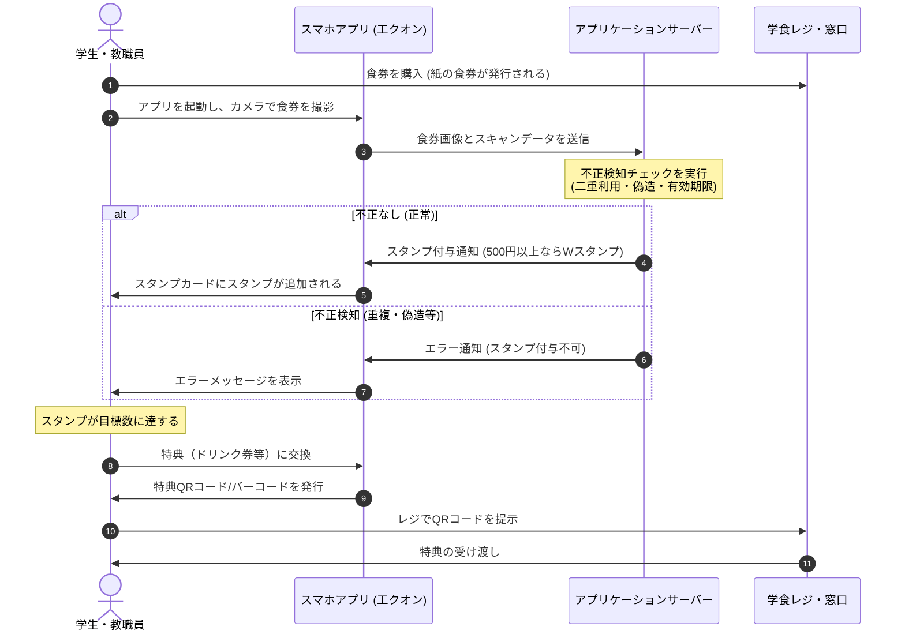
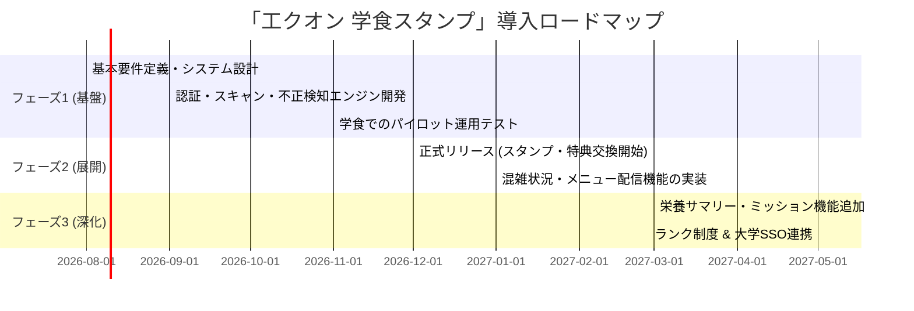

# 「工クオン 学食スタンプ」導入・運営企画提案書（草案）

学生食堂の利用促進と利便性向上、および食堂運営のデジタル化を推進するためのスマートフォン向けWebアプリケーション（PWA）「工クオン 学食スタンプ」の企画提案書およびカスタマー向け機能説明の草案です。

---

## 1. 企画背景と目的

学生食堂（以下、学食）は学生や教職員にとって日常的な憩いの場であり、欠かせないインフラです。しかし、キャッシュレス決済の普及や学外の競合店舗の増加に伴い、より魅力的で利用しやすい環境づくりが求められています。

本プロジェクトは、コカ・コーラ社の「Coke ON」アプリのリワードシステムにインスパイアされ、学食の利用頻度に応じたインセンティブを提供することで、以下の目的を達成します。

* **学食の利用促進**: リピート率の向上と、客単価 of 500円以上利用時のボーナススタンプなど。
* **食堂運営の最適化**: 混雑状況の可視化による利用時間の分散と、データに基づくメニュー改善。
* **完全なデジタル化**: 既存の食券券売機システムに一切手を加えることなく、スマートフォンのカメラ（OCR・画像認識）だけでスタンプシステムを即時導入。

---あああ

## 2. 全体システムフロー

利用者が学食で食券を購入してから、スタンプを獲得し、特典を利用するまでのフローは以下の通りです。

---

## 3. カスタマー（学生・教職員）向け機能説明

利用者が毎日楽しく、便利に学食を利用できるようにするための機能群です。

### 3.1. デジタルスタンプカード & スキャン
* **食券スキャン**:
  食券をスマートフォンのカメラで撮影するだけで、印字された日付、時間、価格、識別番号を自動認識（OCR）し、即座にスタンプが付与されます。
* **スタンプカード表示**:
  集まったスタンプをグラフィカルで分かりやすいスタンプカード形式で確認できます。スタンプが貯まっていくワクワク感を視覚的に提供します。
* **購入履歴**:
  これまでいつ、どのメニュー（価格）を食べたか、どれだけスタンプを獲得したかの履歴が一覧で確認できます。

### 3.2. 特典交換機能
* **スタンプ交換**:
  「15スタンプでドリンク無料券」「20スタンプで学食200円割引クーポン」など、貯まったスタンプに応じた特典とアプリ内でワンタップで交換できます。
* **レジ提示機能**:
  交換した特典は、利用時にアプリ内で専用 of 「ワンタイムQRコード/バーコード」として表示され、食堂レジで提示することで簡単に特典を受けられます。

### 3.3. 学食お役立ち機能（ランチライフをより快適に）
* **本日のメニュー**:
  日替わりメニューや週替わりフェア、限定メニューを写真付きで手軽にチェックできます。
* **混雑状況インジケーター**:
  「空き」「普通」「混雑」の3段階で現在の食堂の混雑具合をリアルタイム表示。ピークタイムを避けた賢い利用をサポートします。
* **栄養サマリー**:
  読み取った食券のデータから、その日のランチの「摂取カロリー」や「主要栄養素」を自動で記録。健康管理ツールとしても活用できます。

### 3.4. エンゲージメント機能
* **ランク制度**:
  月ごとの利用回数や累計利用額に応じて「ブロンズ」「シルバー」「ゴールド」と会員ランクがアップ。ゴールド会員には「特別限定メニューの先行注文権」や「ポイント付与率アップ」などのプレミアムな優遇を用意します。
* **ミッション/チャレンジ**:
  「今週3回学食を利用しよう！」「カレーフェア対象メニューを注文しよう！」といった期間限定のミッションをクリアすることで、ボーナススタンプが獲得できます。

---

## 4. 導入・運営者（大学・生協・食堂運営者）向けメリットと機能

食堂運営側にとって、導入ハードルが極めて低く、高いマーケティング効果が得られる設計となっています。

### 4.1. 既存システムへの「完全アドオン」導入
* **券売機の改造不要**:
  従来の券売機が発行する「紙の食券」をそのまま利用するため、高額な券売機のシステム改修や買い替えコストが一切発生しません。
* **オペレーションの最小化**:
  スタンプの付与はすべて利用者の自己完結スキャンで行われるため、混雑するレジでのスタッフの手間を増やしません。

### 4.2. 鉄壁の不正防止システム
紙の食券スキャンによる運用で懸念される「不正利用」に対し、以下の多層防御システムを搭載しています。

> [!IMPORTANT]
> **不正防止の4つのアプローチ**
> 1. **重複利用 of ブロック**: 食券に印刷されている「一意なハッシュ値（識別子）」をデータベースで照合。一度スキャンされた食券は、2回目以降自動的に拒否されます。
> 2. **偽造検知**: 機械学習モデルにより、本物の食券の紙質、フォント、レイアウト、印刷品質を判定。コピー用紙やスマートフォン画面の提示による偽造をブロックします。
> 3. **手書き・コピーの除外**: 手書き文字や落書き、低品質なコピーの特徴を識別し、不正な読み取り要求を自動排除します。
> 4. **スキャン時間制限**: 食券に印刷された「印字時刻」から、例えば「発行後1時間以内」または「当日中」のみ有効とする時間制限を設け、過去の食券の持ち込みや回収食券の使い回しを防ぎます。

### 4.3. マーケティングデータ（顧客理解）の収集
* **購買行動データの蓄積**:
  誰が（学籍番号に紐づく属性）、いつ、いくらのメニューを食べたかを匿名化された形で収集。
* **メニュー開発へのフィードバック**:
  売れ筋メニューの推移、時間帯別の客単価などをダッシュボードで視覚化し、仕入れの最適化や新メニューの開発に直結させます。

---

## 5. 導入ロードマップ（案）

段階的に機能をリリースし、ユーザーフィードバックを得ながら完成度を高めます。

---

## 6. 財源および予算計画（案）

本プロジェクトの導入・運用における想定財源および予算項目の区分は以下の通りです。

### 6.1. 特典（インセンティブ）原資の財源
* **[高尾部長の懐マネー]**:
  * 想定財源: [当面の間は起業部員個人による寄付によって運営]
  * 主な用途: 特典交換用の景品(文房具や日用品)、デジタル商品券

## 7. おわりに

「工クオン 学食スタンプ」は、スマートフォンの利便性を最大限に活かし、学食を単なる「食事の場所」から「毎日お得で楽しいリワード体験ができる場所」へと進化させます。
既存のオペレーションを妨げることなく、学生のロイヤルティ向上と食堂運営の効率化を同時に実現する本ソリューションの導入をご提案いたします。
